# Customer Journey — BaseIA

**Status:** Phase 1 partial lock + Phase 2 partial (steps 1-2). Steps 3+ pendentes de interview interativo.
**Source of truth para decisões:** [`_shape/2026-04-24-customer-journey-reset-shape.md`](_shape/2026-04-24-customer-journey-reset-shape.md) (append-only)
**Last updated:** 2026-04-24 autonomous run

---

## Persona v0.2 (LOCKED)

> **Solo founder** de PME, 1-2 pessoas, decide e paga do bolso. Baixa literacia em IA, sem tempo. Busca **ampliar capacidade sem contratar próximo CLT** — começando por atividades recorrentes de back-office financeiro (prestação de contas, conciliação). Típico: bateu teto MEI/ME e precisa regularizar CNPJ pra escalar.

**Autoridade de decisão:** Solo — 1 pessoa (ele próprio).
**Setup operacional:** 1-2 pessoas (ele + contador externo ou esposa/parente como apoio).
**Preço-sensibilidade:** Alta (paga do bolso).
**Capacidade técnica:** Baixa pra operar ferramenta complexa.

**Segmentos secundários deferidos:** 2-3 sócios e CEO 20+ ficam fora da Phase 2 primária. Mapear depois de PMF do primário.

---

## Canal de descoberta (step 2 — LOCKED)

**Canal:** B — Wedge "Regularizar CNPJ grátis"
**Sub-flavor:** Regularizar (operador MEI/ME existente batendo teto), não abrir (pre-revenue).
**Por que regularizar:** ICP matching com produto BaseIA (back-office recorrente). Pre-revenue não tem back-office pra automatizar.
**Motor (paid / SEO / founder content):** Deferido. Decisão de go-to-market, não de jornada.

---

## Trigger context (hypothesis, NOT a journey unit)

> **Collapsed em finding #2, 2026-04-25:** Trigger event não é touchpoint mensurável (mental state pre-discovery). Foi removido do SDD como unit. O que segue abaixo é **contexto hypothesis** pra informar headlines, comms e segmentação — não é step formal da journey. Trigger capture real (`which_trigger` MCQ + discovery prompt for 'other') vive em onboarding unit (parked, Phase 1 interview vai locar).

Solo founder sofre um dos 4 gatilhos. Não é evento único — é padrão convergente.

| # | Trigger | Comm tone pra segmentar no step 2 |
|---|---------|-----------------------------------|
| a | Perdeu alguém do financeiro e não quer repor | Operacional — urgência, alívio imediato, "escala sem CLT" |
| b | Fechou o mês com erro de conciliação / prejuízo não detectado | Controle — trust, zero-erro, reputação, "faz o back-office sozinho" |
| c | Bateu teto de faturamento mas CLT impede contratar | Operacional — mesmo tom de (a) |
| d | Viu concorrente/colega usando IA e ficou com FOMO | Educativa — desmistificar IA, mostrar case |
| other | Trigger fora dos 4 canônicos | Discovery — follow-up "o que te trouxe aqui?" (open-text). Resposta tenta reclassificar automaticamente em a/b/c/d via keyword match; se sem match, entra queue de revisão semanal pra Romeu ampliar taxonomia. Sem CTA de produto até reclassificar (evita comm errada). |

Triggers a+c convergem; b e d têm comms distintas. `other` é discovery loop — não comm tactic estável; serve pra capturar trigger novo OU reclassificar.

---

## Phase 2 — Flowchart table

**Todas as 9 colunas são mandatory per ULTRAPLAN constraint (col 9 adicionada 2026-04-25 finding #7). Coluna 8 (validation pattern) é prosa human-readable; coluna 9 (validation signature) é canonical hashable form.**

> **Step 1 collapsed (finding #2, 2026-04-25):** Trigger event não é touchpoint observável (mental state pre-discovery). Trigger capture (`which_trigger` MCQ + discovery prompt for 'other') migra pra onboarding unit — parked, Phase 1 interview vai locar como step >2 com phase_id próprio. Trigger context fica documentado na seção acima. Numeração de steps preservada (phase_id 2 é primeiro unit lockado).

| Step | Customer action | Input | Output | System touchpoint | Communication trigger | Decision/branch buttons | Validation pattern | Validation signature |
|------|-----------------|-------|--------|-------------------|-----------------------|-------------------------|--------------------|----------------------|
| 2 | Solo founder encontra wedge "Regularizar CNPJ grátis" e clica pro landing | Search intent OR referral link OR anúncio paid OR founder content | User na wedge landing page com intent explícita de regularizar CNPJ | Wedge landing page (web) com gate `is_existing_cnpj` (yes/no); branch yes → flow regularizar com checkbox opcional `back_office_optin`; branch no → educational redirect + waitlist opt-in | Headline variants por trigger: a/c → "Regularize seu CNPJ sem contratar contador fixo"; b → "Regularize seu CNPJ sem travar no mês"; d → "Como outros founders estão regularizando com IA"; gate "Você já tem CNPJ?" precede CTA; checkbox "Quero ajuda contínua com back-office" no submit | `is_existing_cnpj` (gate yes/no antes de tudo) / `start_regularization` (primary CTA path-yes) / `talk_to_human` (secondary escape) / `learn_more` (educational) / `waitlist_optin` (path-no opt-in) / `back_office_optin` (path-yes checkbox pra cross-sell back-office) | **Metric threshold + webhook callback + behavioral gate.** (1) Conversion landing → email/CNPJ submit ≥8% em 500 sessões (anchor: B2B SaaS self-serve high-intent 4-10%, Unbounce/daydream 2025); revisit >15%/<4%; **(2) Gate `is_existing_cnpj`** filtra ICP — visitor "no" (pre-revenue, intent abrir CNPJ) vai pra educational page com link externo (Sebrae/parceiro contábil) + opt-in waitlist (não default); (3) Webhook n8n no submit captura trigger+variant; (4) Webhook separado no waitlist_optin captura cohort off-ICP pra nurture longo (12-18m); (5) Webhook separado no `back_office_optin` capture cohort cross-sell qualified pra Step 4 onboarding; (6) A/B golden-output 3 headlines, retention @ D7 tie-breaker. | `behavioral_self_report:cnpj_state_gate`; `golden_output:headline_ab_retention_d7`; `metric_threshold:landing_to_submit_conversion>=0.08@500sess`; `webhook_callback:back_office_optin_capture`; `webhook_callback:submit_event_capture`; `webhook_callback:waitlist_optin_event` |
| 3 | Solo founder recebe email auto-responder com next steps da regularização (D0); pode clicar status link ou responder pra tiered handler | Submission record da unit 2 — `{email, CNPJ, trigger_self_report, headline_variant, timestamp}` | Auto-responder email enviado D0 + tiered reply handler ativo (bot triagem + escalation Romeu/contador) | Email transactional service (Resend) + tiered reply handler (n8n + Anthropic Haiku/Sonnet pra bot triagem; escalation pra Romeu/contador via inbox unificada) | Webhook on unit 2 submit dispara email com template selecionado por `trigger_self_report` (a/c → operacional, b → controle, d → educativa, other → discovery prompt) | `click_status_link` (status page) / `reply_email` (route via tiered handler) | **Metric threshold + tiered handler.** (1) Auto-responder reply rate ≥10% medido sobre janela de 500 submits (= 500 emails enviados); revisit triggers TBD após 1ª medição real. (2) Tiered handler: AI bot via n8n+Anthropic responde FAQs (status, prazos, docs); confidence baixo OU pergunta fora de scope predefinido → escala pra Romeu/contador. (3) Webhook callback no email send (D0) e on reply (any time post-D0). | `human_checkpoint:bot_escalation_to_romeu`; `metric_threshold:auto_responder_reply_rate>=0.10@500submits`; `webhook_callback:email_send_event`; `webhook_callback:reply_received_event` |
| 4 | Solo founder (back_office_optin=true) loga 1ª vez no BaseIA back-office: vê Receita Federal data pre-populada, sistema auto-roda 1ª conciliação como demo de valor, pede approval pra default future auto-runs | User com `back_office_optin=true` da unit 2 + regularização completed evento (Receita Federal data disponível) | Onboarded user com 1ª conciliação AI auto-rodada exibida + approval status pra future runs (default_auto_runs: yes/no) | App back-office BaseIA (web/mobile) com seed Receita Federal + AI conciliador (Anthropic via n8n) + UI approval gate | Triggered pelo evento regularization_completed + back_office_optin=true → app auto-provision + email "BaseIA pronto pra você" com link login | `approve_auto_runs` (default future a auto) / `keep_manual_runs` (toggle off, cada run requer click) / `dispute_first_run` (challenge AI output → review queue) | **Golden-output + metric_threshold + human_checkpoint.** (1) Golden-output: 1ª conciliação AI comparada com baseline rule-based deterministic; accuracy ≥95% antes de mostrar pro user. (2) Metric threshold: first-login completion rate ≥70% @ 500 opt-ins (preliminary, calibrar pós-launch). (3) Webhook: first_login_event + first_run_completed_event capturam estado de onboarding. (4) Human checkpoint: dispute_first_run flow envia AI output pra Romeu/contador review queue (D0 trust-protection). | `golden_output:first_conciliacao_ai_vs_rulebased_accuracy>=0.95`; `human_checkpoint:dispute_first_run_review`; `metric_threshold:first_login_completion_rate>=0.70@500optins`; `webhook_callback:first_login_event`; `webhook_callback:first_run_completed_event` |
| 5 | User experiencia first WIN — BaseIA surface error/discrepancy se AI encontra (confidence ≥95%), fallback clean conciliação report. Trigger-tone copy reforça win por persona (a/c=`não tive trabalho`, b=`achou erro que perdi`, d=`IA funciona pra mim`) | First conciliação output da unit 4 (golden-output ≥95% já validated) + AI error-detection pass (Sonnet 4.6) | User exposed to first WIN moment com win_type registered (error_found OR clean_report) + trigger-tone-matched comm + user feedback captured (error_relevance_confirm OR dismissed) | App back-office BaseIA UI com win-screen layer + AI error-detection (Sonnet 4.6) + trigger-tone copy gen (Haiku 4.5 do unit 2 reusado) + human review queue pra primeiros 3 wins por client | Triggered no first_run_completed da unit 4 → AI error-detection pass → if error_found_with_high_confidence display win-screen com error highlight; else display clean win-screen; copy variant matches trigger | `confirm_error_relevant` (user valida AI achou erro real) / `dismiss_error` (user marca false positive — feedback loop) / `share_win` (refer-a-friend, deferred Phase scope) | **Layered validation (mixed).** (1) AI confidence gate: error claim só surface se AI confidence ≥95% (alta barra, false positives matam trust). (2) Golden-output: AI error claim diff'd contra rule-based reference engine (ambos têm que flagar). (3) Human checkpoint: primeiros 3 wins por client → Romeu/contador review queue antes de display (D0 trust insurance). (4) Behavioral self-report: user confirma OR dismisses error claim. (5) Metric threshold: win-event-rate ≥70% em 500 opt-ins (value perception landing). (6) Webhook captures win_event + error_dismissed (negative feedback loop). | `behavioral_self_report:error_relevance_confirm`; `golden_output:ai_error_claim_vs_rulebased`; `human_checkpoint:first_3_wins_per_client_review`; `metric_threshold:ai_confidence_on_error_claim>=0.95`; `metric_threshold:win_event_rate>=0.70@500optins`; `webhook_callback:error_dismissed_event`; `webhook_callback:win_event_capture` |
| 6 | User entra retention/recurring loop. Paywall ativo após N=3 (preliminary) conciliações successful. Re-engagement entre month-end closes via push notification em unusual transactions detectadas | Unit 5 first WIN consumed + recurring conciliação cycle ativo (monthly) | User convertido em paying (post-paywall accept) OR churn (decline); + retention engagement events captured (push opens, paywall events, monthly active state) | App back-office com paywall UX + payment gateway (Stripe Brasil ou similar) + push notification infra (web/mobile) + unusual-transaction detection AI (reuse Step 5 model com sensitivity diferente) + subscription state DB | Triggered: (a) paywall display após Nth successful conciliação por user; (b) push notification dispatched em unusual transaction event AI-flagged | `accept_paywall` (subscribe) / `decline_paywall` (churn signal) / `tap_unusual_notification` (re-engagement) / `dismiss_notification` (push fatigue signal) | **Subscription + retention metrics.** (1) Metric threshold: paywall conversion rate ≥15% em 500 eligible users (proof-of-value gate atingiu N=3 successful conciliações). (2) Metric threshold: push notification tap rate ≥15% em 500 pushes (signal-to-noise OK). (3) Webhook captures paywall_event + unusual_txn_push_event + notification_dismissed_event. (4) Behavioral self-report opcional: post-paywall pesquisa "porque cancelou?" pra churned users. | `behavioral_self_report:churn_reason_post_paywall`; `metric_threshold:paywall_conversion_rate>=0.15@500eligible`; `metric_threshold:push_notif_tap_rate>=0.15@500pushes`; `webhook_callback:notification_dismissed_event`; `webhook_callback:paywall_event`; `webhook_callback:unusual_txn_push_event` |

> **Phase 1 termina em Step 6 (decisão Q11/option A, 2026-04-25).** Steps 7+ (referral, expansion, multi-entity, churn handling) deferred pra Phase 2 quando PMF data disponível. Trigger pra unlock Phase 2: ≥N paying clients sustentados por ≥M meses (definir em Phase 2 entry).

---

## Validation pattern vocabulary (reference)

Patterns permitidos pela coluna "Validation pattern" (ULTRAPLAN constraint):

1. **Schema assertion** — expected input/output shape (tipos, campos obrigatórios).
2. **Golden-output comparison** — resultado real vs. resultado esperado pré-canonizado.
3. **Human-in-the-loop checkpoint** — aprovação humana embedada no fluxo (não podefalhar silenciosamente).
4. **Webhook callback (n8n-style)** — evento assíncrono confirma estado downstream. Inspired by Romeu's n8n pipeline discipline.
5. **Metric threshold** — KPI numérico com go/no-go explícito (ex: conversão ≥X%, accuracy ≥98%).
6. **Behavioral self-report** — user identifica próprio state/intent via questionnaire ou UI select.

Cada step ≥1 pattern. Múltiplos permitidos. Sem pattern = step não entra no SDD (Phase 4) nem na AI execution map (Phase 5).

---

## Mermaid flowchart

**LOCKED 2026-04-25** (Phase 1 interview complete, Q1-Q11 todos resolvidos). Validated via Mermaid Chart MCP (`valid: true`, diagramType=flowchart).

```mermaid
flowchart TD
    Triggers["Trigger context (a/b/c/d/other)<br/>Hypothesis only — NOT a unit"]:::context

    Step2["Step 2: Wedge landing<br/>'Regularizar CNPJ grátis'"]:::unit
    Gate{"is_existing_cnpj?"}
    EduPage["Educational page<br/>+ external link Sebrae/contador"]
    WaitlistOptin{"waitlist_optin?"}
    WaitlistDB[("Off-ICP cohort<br/>nurture 12-18m")]
    OffFunnel(["End — off-funnel"]):::endNode
    Submit["Submit form:<br/>email + CNPJ + trigger +<br/>back_office_optin?"]

    Triggers --> Step2
    Step2 --> Gate
    Gate -- "no" --> EduPage
    EduPage --> WaitlistOptin
    WaitlistOptin -- "yes" --> WaitlistDB
    WaitlistOptin -- "no" --> OffFunnel
    Gate -- "yes" --> Submit

    Step3["Step 3: Auto-responder D0<br/>+ tiered reply handler"]:::unit
    BotTriage{"Reply received?"}
    BotResolve["Bot answers FAQ"]
    HumanEscalate["Romeu/contador<br/>handle escalation"]

    Submit --> Step3
    Step3 --> BotTriage
    BotTriage -- "in scope" --> BotResolve
    BotTriage -- "out of scope" --> HumanEscalate

    OptinCheck{"back_office_optin?"}
    WedgeOnly(["End — wedge-only customer"]):::endNode
    Step4["Step 4: Onboarding<br/>1ª conciliação auto"]:::unit
    GoldenCheck{"Golden-output ≥95%?"}
    DisputeQueue[("Romeu/contador<br/>review queue")]
    ApprovalGate{"Future runs?"}

    Submit --> OptinCheck
    OptinCheck -- "no" --> WedgeOnly
    OptinCheck -- "yes" --> Step4
    Step4 --> GoldenCheck
    GoldenCheck -- "no" --> DisputeQueue
    GoldenCheck -- "yes" --> ApprovalGate
    DisputeQueue --> Step5
    ApprovalGate -- "approve OR keep_manual" --> Step5
    ApprovalGate -- "dispute_first_run" --> DisputeQueue

    Step5["Step 5: First WIN<br/>error_found OR clean"]:::unit
    ErrorDetect{"AI confidence ≥95%?"}
    GoldenWin{"Rule-based agrees?"}
    First3Check{"First 3 wins this client?"}
    CleanPath["Display clean_report"]
    WinScreen["Win-screen rendered<br/>(trigger-tone copy)"]
    UserFeedback{"User clicks?"}
    RetrainSignal[("Feedback loop")]
    ReferralOut(["End Phase 1<br/>referral = Phase 2"]):::endNode

    Step5 --> ErrorDetect
    ErrorDetect -- "yes" --> GoldenWin
    GoldenWin -- "yes" --> First3Check
    GoldenWin -- "no" --> CleanPath
    ErrorDetect -- "no" --> CleanPath
    First3Check -- "yes 1-3" --> DisputeQueue
    First3Check -- "no >3" --> WinScreen
    CleanPath --> WinScreen
    WinScreen --> UserFeedback
    UserFeedback -- "confirm_error_relevant" --> Step6
    UserFeedback -- "dismiss_error" --> RetrainSignal
    UserFeedback -- "share_win" --> ReferralOut
    RetrainSignal --> Step6

    Step6["Step 6: Retention loop<br/>paywall + push"]:::unit
    NCheck{"N ≥ 3 successful?"}
    RecurringRun["Recurring conciliação<br/>n8n cron mensal"]
    PaywallDisplay["Paywall display"]
    ChurnDecide{"User decides?"}
    PayingActive(["Paying active"]):::endNode
    Churned[("Churned + survey")]
    PushLoop{"Unusual txn?"}
    PushDispatch["Push notification"]
    PhaseEnd(["End Phase 1<br/>Steps 7+ = Phase 2"]):::endNode

    Step6 --> NCheck
    NCheck -- "no" --> RecurringRun
    RecurringRun --> NCheck
    NCheck -- "yes" --> PaywallDisplay
    PaywallDisplay --> ChurnDecide
    ChurnDecide -- "accept_paywall" --> PayingActive
    ChurnDecide -- "decline_paywall" --> Churned
    PayingActive --> PushLoop
    PushLoop -- "yes" --> PushDispatch
    PushLoop -- "no" --> RecurringRun
    PushDispatch --> PhaseEnd

    classDef unit fill:#e3f2fd,stroke:#1976d2,stroke-width:2px,color:#000
    classDef context fill:#fff3e0,stroke:#f57c00,stroke-width:1px,stroke-dasharray:5 5,color:#000
    classDef endNode fill:#c8e6c9,stroke:#388e3c,stroke-width:1px,color:#000
```

**Key branches encoded:**
- `is_existing_cnpj` gate (finding #10) — yes/no path divergence
- `back_office_optin` checkbox (Q4) — wedge-only vs onboarding cohort
- Golden-output validation (Step 4 + Step 5) — both gates route to dispute/review queue on fail
- Trust-protection: first 3 wins per client routed via human review
- Recurring loop: n8n cron mensal → conciliação → paywall gate at N=3 → push notif on unusual txn
- Phase 1 endpoints (verde): off-funnel exit, wedge-only customer, paying active, referral (=Phase 2 trigger), Steps 7+ deferred

---

## Human-in-loop queue (Romeu's return)

1. **Revisar steps 1-2** acima. Confirmar customer action, decision buttons, validation pattern. Corrigir se necessário (mudanças devem ser appended ao shape same-turn per rule).
2. **Completar Phase 1 interview** pros steps 3+ (primeiro contato, onboarding, primeira wins, retention, expansion, etc — estrutura exata depende do interview interativo).
3. **Renderizar Mermaid** após Phase 1 full lock.
